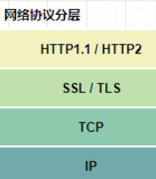
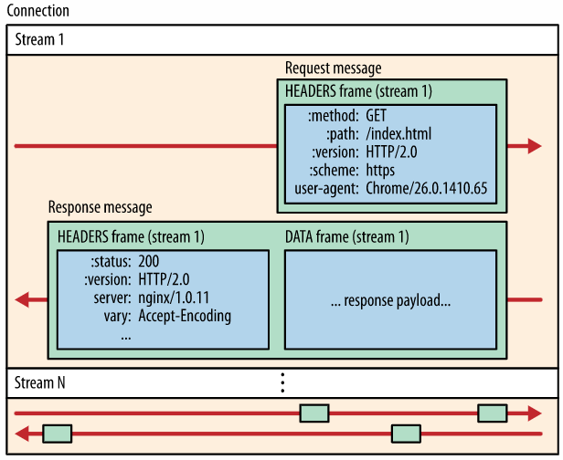
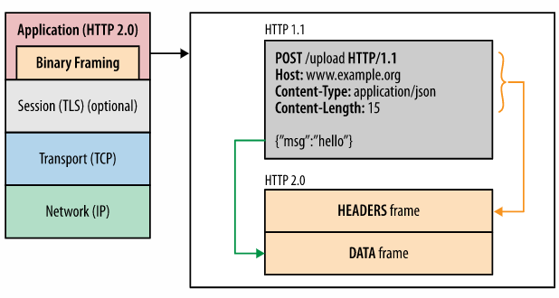
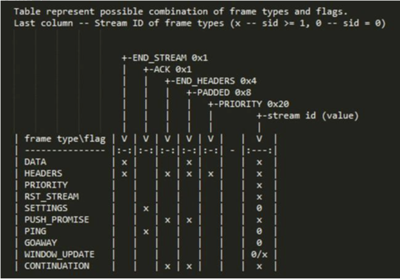
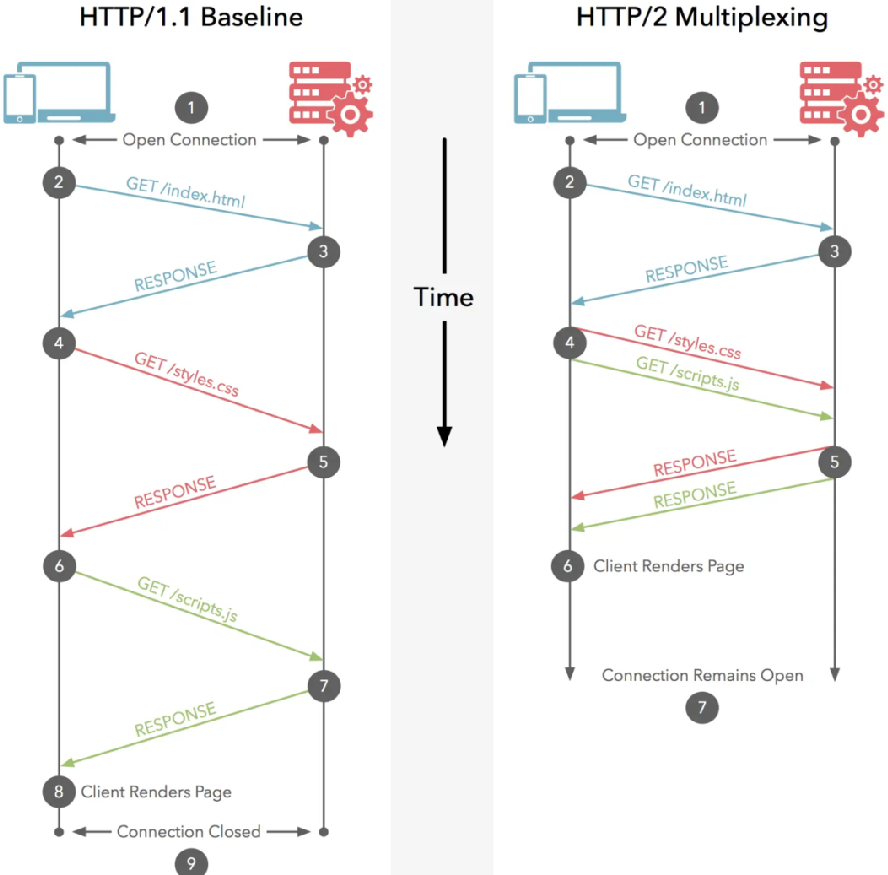
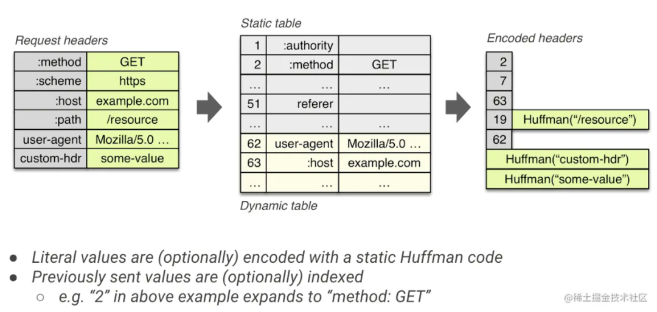

[TOC]

## 1、HTTP2 简介
HTTP2 是一个应用层传输协议，它是 HTTP 协议的第二个版本。HTTP2 主要是基于 google 的 SPDY 协议，SPDY 的关键技术被 HTTP2 采纳了，因此 SPDY 的成员全程参与了 HTTP2 协议制定过程。

HTTP2 是由互联网工程任务组 (IETF) 的 httpbis(Hypertext Transfer Protocol Bis) 工作小组开发。

多数浏览器在 2015 年底支持了该协议。

## 2、HTTP1.1 遇到哪些问题
### 2.1 HTTP 1.1 协议繁琐
HTTP 1.1 包含很多的细节设计，也预留了很多未来扩展选项。所以没有软件实现了协议中提及的全部细节。

比如 Head 头协议内容也很多，有的相似性还比较高。

随着互联网发展，有一些不常用的功能后来慢慢被用上。比如 HTTP Pipelining，可以提高传输速度。

### 2.2 未充分利用 TCP 性能
HTTP1.1 很难充分利用 TCP 提供的性能。HTTP客户端和浏览器就要找寻其它方法来解决页面加载时间过多的问题。

### 2.3 延迟问题
随着互联网的发展，传输资源的数量和 size 大小都增加了很多。比如很多网站首页需要下载的资源数量明显增加了很多，下载慢的话，渲染页面时间就会增加，导致用户体验下降。HTTP 1.1 也提出了一种解决方案 - HTTP Pipelining 技术。

HTTP Pipelining 把多个 HTTP 请求放到一个 TCP 连接中来发送，发送过程中不需要服务器对前一个请求的响应。但是在客户端，还是会按照发送的顺序来接收响应请求。这就导致一个问题，就是 Head-of-line blocking。

### 2.4 Head-of-line blocking(HTTP头阻塞)
在 2.3 小结中简单介绍了 HTTP Pipelining，这个技术也导致了一个问题 Head-of-line blocking。

HTTP 1.1 利用 pipelining 可以同时在一个 TCP 中发送多个 HTTP 请求，但是客户端接收服务端响应信息时，还是按照发送时的顺序来接收响应信息。

这会导致一个什么问题呢？

客户端接收时，如果第一个响应信息慢，会导致后面的响应信息阻塞。因为 http1.1 以前协议规定是一发一收这种模式，相当于一个先进先出的串行队列。服务器端为了按序返回响应信息也会占用很多服务器资源。

比如一些资源发送到服务器：js、css，服务器不能对他们进行分块解析，需要解析完 js 后，才会去解析 css 资源，这中解析方式肯定是一种低效率的解析方式，需要改进。
```
上面就是 http1.1 协议遇到的一些主要问题。
```
## 3、HTTP2 怎么解决上面问题
### 1.对 HTTP 头字段进行数据压缩，使用 HPAKC 算法。
HTTP 头字段多，所以采用压缩算法来进行压缩大小传输。

### 2.修复 HTTP 头阻塞(Head-of-line blocking)问题
这就与 HTTP2 协议设计有关，主要涉及 3 个概念，流、消息、帧。

流：stream，存在于 TCP 连接中的一个虚拟连接通道。每个流通道都有一个整数 ID 标识，流还可以承载双向消息。

消息：message，它是由数据帧构成。

帧：data frame，HTTP2 中构成消息的最小单位。消息有一个或多个帧构成。数据帧中有 1 个关键数据，这个帧属于哪个资源。也就是解析后可以直接组成资源。

下面章节内容会详细介绍 HTTP2 协议内容。

### 3.延迟问题
也是跟 HTTP2 协议设计相关。

HTTP2 的一些其他特性：

### 4.多路复用
服务端推送
消息报文是二进制格式
HTTP2 性能提升演示 demo
演示地址：https://http2.akamai.com/demo

## 4、HTTP2 特性介绍
二进制分帧
头部字段压缩
多路复用
服务端推送
流量控制和资源优先级

## 5、HTTP2 协议内容详解
### 5.1 HTTP2 协议概述
HTTP2 是基于 HTTP 语义，它提供了一种优化传输机制。HTTP2 支持 HTTP1.1 所有核心特性，HTTP2 从以下几个方面进行了改进：

HTTP2 中最小的传输单元叫做帧。HTTP2 定义了很多类型的帧，每个帧服务于不同的目的。例如 HEADERS 和 DATA 帧就构成了 HTTP 请求和应答的主体。还有其它的比如 WINDOW_UPDATE, PUSH_PROMISE 等帧类型用于支持 HTTP2 的其它特性。
多路复用。每个 HTTP 请求/应答在各自的流（stream 也是 HTTP2 中的一个很重要概念）中完成数据交换。每个流都是相互独立。因此如果一个请求/应答阻塞或者速度很慢，也不会影响其它流中的请求/应答处理。在一个 TCP 连接中就可以传输多个流数据而无需建立多个连接。
流量控制和优先级机制。这个可以有效利用流的多路复用机制。流量控制可以确保只有接收者使用的数据会被传输。优先级机制可以确保重要的资源被优先传输。
HTTP 增加了一种新的交互模式。即服务端可以推送应答给客户端。
HEAD 头数据压缩。因为 HTTP 头包含了大量冗余数据，HTTP2 对这些数据进行了压缩，压缩后对于请求大小的影响显著，可以将多个请求压缩到一个包中。
HTTP2 数据采用二进制编码，而不是原来的文本格式数据。
HTTP2 协议有两个标识符：

字符串 "h2" 标识使用了 TLS 的 HTTP2 协议。该标识符用在 TLS-ALPN 的扩展字段，以及其他需要标示运行于 TLS 之上 HTTP2 的地方。
字符串 "h2c" 标识在构建在 TCP 之上的 HTTP2 协议，它是明文传输。该标识符用在 HTTP/1.1 的 Upgrade 首部字段，以及其他需要标示运行于 TCP 之上 HTTP/2 的地方。"h2c" 字符串保留在 ALPN extension 标识符空间，但是实际上标示了一个不使用 TLS 的协议。
### 5.2 HTTP1.1 协议怎么升级到 HTTP2 协议
#### 5.2.1 HTTP 升级
因为 HTTP1.1 协议会存在很长时间，所以怎么把 HTTP1.1 协议升级到 HTTP2 协议就很关键了。

客户端发起一个 http URI 请求时，如果事前不知道下一跳是否支持 HTTP2，需要使用 HTTP Upgrade 机制。客户端发起一个 HTTP1.1 请求，其中包含 "h2c" 的 Upgrade 首部字段，该请求还必须包含一个 HTTP2-Settings 首部字段。

例如：

```
GET / HTTP/1.1
Host: server.example.com
Connection: Upgrade, HTTP2-Settings
Upgrade: h2c
HTTP2-Settings: <base64url encoding of HTTP/2 SETTINGS payload>
```
Connection 连接方式是升级协议
Upgrade 升级到什么协议，例子中是升级到 h2c
如果服务器不同意升级或者不支持 Upgrade 升级，可以直接忽略，当成是 HTTP1.1 请求和响应就好了。

如果服务器同意升级，响应格式为：

```
HTTP/1.1 101 Switching Protocols
Connection: Upgrade
Upgrade: h2c

[ HTTP/2 connection ...
```
HTTP 响应升级的状态码是 101(Switching Protocols)。在结束 101 响应的空行后，服务端可以开始发送 HTTP2 数据帧了。

更多详细内容请查看 RFC7540: https://www.rfc-editor.org/rfc/rfc7540#page-8

#### 5.2.2 HTTPS 升级
以上都是没有涉及到 HTTPS ，现在 HTTP2 几乎都是用到了 HTTPS（TLS），这个又怎么升级呢？

前面讲到，运行在 TLS 之上的 HTTP2 协议标识为 “h2”，客户端不能发送 “h2c" 协议标识，服务端自然也不能选择 "h2c" 协议响应。

多了 TLS 之后，客户端和服务端双方需等到成功建立 TLS 连接之后才能发送应用数据。而建立 TLS 连接，双方本来就要进行协商，引入 HTTP2 之后，要做的就是在原来协商机制中把 HTTP2 的协商机制加进去。

HTTP2 是基于 Google 的 SPDY 协议开发的，在 SPDY 中开发了一个名为 NPN （Next Protocol Negotiation，下一代协议协商）的 TLS 扩展协议。而在 HTTP2 中，NPN 被 HTTP2 修改为 ALPN（Application Layer Protocol Negotiation，应用层协议协商），它也是 TLS 的扩展协议。也就是说构筑在 TLS 上的 HTTP2，使用 ALPN 扩展协议进行协商。

网络分层， TLS 位于哪一层



TLS v1.2 握手协议简略交互图：
```
     Client                                               Server

      ClientHello                  -------->
                                                      ServerHello
                                                     Certificate*
                                               ServerKeyExchange*
                                              CertificateRequest*
                                   <--------      ServerHelloDone
      Certificate*
      ClientKeyExchange
      CertificateVerify*
      [ChangeCipherSpec]
      Finished                     -------->
                                               [ChangeCipherSpec]
                                   <--------             Finished
      Application Data             <------->     Application Data
```
（Message flow for a full handshake，https://www.rfc-editor.org/rfc/rfc5246#section-7.3，打 * 号都是可选项）

在 RFC5246 中 7.4.1.2 小结的 TLS 的 Client Hello 结构：

```
struct {
          ProtocolVersion client_version;
          Random random;
          SessionID session_id;
          CipherSuite cipher_suites<2..2^16-2>;
          CompressionMethod compression_methods<1..2^8-1>;
          select (extensions_present) {
              case false:
                  struct {};
              case true:
                  Extension extensions<0..2^16-1>;
          };
} ClientHello;
```

上面的 Extension 在 7.4.1.4 Hello Extensions 中有定义：

```
struct {
          ExtensionType extension_type;
          opaque extension_data<0..2^16-1>;
} Extension;

enum {
          signature_algorithms(13), (65535)
} ExtensionType;

Here:

-  "extension_type" identifies the particular extension type.

-  "extension_data" contains information specific to the particular
      extension type.
```

APEN 扩展
在 HTTP2 的 APNE 扩展结构在 rfc7301 中第 3 小结也有定义：

```
A new extension type ("application_layer_protocol_negotiation(16)")
is defined and MAY be included by the client in its "ClientHello"
message.

enum {
       application_layer_protocol_negotiation(16), (65535)
} ExtensionType;

The "extension_data" field of the
("application_layer_protocol_negotiation(16)") extension SHALL
contain a "ProtocolNameList" value.

opaque ProtocolName<1..2^8-1>;

struct {
       ProtocolName protocol_name_list<2..2^16-1>
} ProtocolNameList;

"ProtocolNameList" contains the list of protocols advertised by the
client, in descending order of preference.  Protocols are named by
IANA-registered，opaque, non-empty byte strings, as described further
in Section 6 ("IANA Considerations") of this document
```

更多信息请查看这里：https://www.rfc-editor.org/rfc/rfc5246

### 5.3 HTTP2 协议内容解
HTTP2 协议是由 HTTP1.1 升级而来，HTTP 的语义不变，提供的功能没有变化，HTTP方法、状态码、URI和Header字段这些都没有变化。在 HTTP2 中，传输数据时编码是不同的，与换行符分隔文本的 HTTP1.1 协议不同，HTTP2 中数据交换都被拆分为更小的消息和帧，而每个消息和帧都是用二进制格式来编码。帧是 HTTP2 中最小数据单元。

#### 5.3.1 HTTP2 数据中几个重要的概念-帧、消息、流
帧 frame：HTTP2 中最小通信数据单元，每个帧至少包含了一个标识（stream identifier，简称stream id）该帧所属的流。

消息 message：消息由一个或多个帧组成。例如请求的消息和响应的消息。

流 stream：存在于 HTTP2 连接中的一个“虚拟连接通道“，它是一个逻辑概念。流可以承载双向字节流，及是客户端和服务端可以进行双向通信的字节序列。每个流都有一个唯一的整数 ID（stream identifier） 标识，由发起流的一端分配给流。

单个 HTTP2 连接可以包含多个同时打开的流，任何一个端点（客户端和服务端）都可以将多个流的消息进行传输。这也是多路复用关键所在。一个 TCP 连接（HTTP2 连接建立在 TCP 连接之上）里可以发送若干个流（stream），每个流中可以传输若干条消息（message），每条消息由若干二进制帧（frame）组成。

任何一端都可以关闭流。在流上发送消息的顺序很重要，最后接收端会把 Stream Identifier (同一个流) 相同的帧重新组装成完整的消息报文。特别是 HEADERS 帧和 DATA 帧的顺序在语义上非常重要。

HTTP2 中连接Connection、流Stream、消息Message、帧Frame的关系示意图如下：



​ （来自：https://hpbn.co/http2）

#### 5.3.2 二进制分帧层(HTTP2格式框架)



从上图可以看出，HTTP1.1 是明文文本，而 HTTP2.0 首部（HEADERS）和数据消息主体（DATA）都是帧（frame）。frame 是 HTTP2 协议中最小数据传输单元。

#### 5.3.3 帧Frame的格式#
一旦建立了 HTTP2 连接，端点（endpoints）间就可以开始交换帧数据。

所有的帧数据都是以一个固定的 9 字节开头(Frame Payload之前)，后面跟一个可变长度的有效负载Frame Payload，这个可变长度的长度值由字段 Length 来表示。

帧的格式：

```
+-----------------------------------------------+
|                 Length (24)                   |
+---------------+---------------+---------------+
|   Type (8)    |   Flags (8)   |
+-+-------------+---------------+-------------------------------+
|R|                 Stream Identifier (31)                      |
+=+=============================================================+
|                   Frame Payload (0...)                      ...
+---------------------------------------------------------------+
```
（from：https://www.rfc-editor.org/rfc/rfc7540.html#section-4.1）

另外的一种表示法，这种表示方法感觉跟编码形式比较接近：

```
HTTP Frame {
  Length (24),
  Type (8),

  Flags (8),

  Reserved (1),
  Stream Identifier (31),

  Frame Payload (..),
}
```
（来自：https://httpwg.org/specs/rfc9113.html）

Length：24 个 bit 的无符号整数，用来表示 Frame Payload 的长度占用字节数。这个 Length 值的范围为 0 - 16384(2^14)。触发接收方设置了一个更大的值 SETTINGS_MAX_FRAME_SIZE 。

帧头的 9 字节不包含在这个 Length 值中。

Type：定义 Frame 的类型，8 bits 表示。帧类型决定了帧的格式和语义。实现的话必须忽略或抛弃未知类型的帧。

Flags：为帧Frame类型保留的 8 bit 的布尔值，这个标志用于特定的帧Frame类型语义。如果这个字段没有被标识为特定帧类型语义，那么接收时必须被忽略，并且发送时不设置（0x0）。

R(Reserved)：一个保留的 1 bit 字段，这个字段语义未定义。发送时必须保持未设置（0x0），接收时忽略。

Stream Identifier：流标识，31 bit 的无符号整数。值 0x0 保留给与整个连接相关联的帧，而不是单个流。

Frame Payload：内容主体，由帧的类型决定。

#### 5.3.4 有哪些帧类型Type#
上一小节的 Type 字段，即帧类型，在 HTTP2 中共分为 10 种类型：

每一种类型帧都由一个 8 位类型代码来识别。每种帧类型在建立和管理整个连接或单个数据流时都有不同的作用，
Type | Code(Type 值) | 说明
---|---|---
DATA|	0x00|	数据帧（type=0x00），内容主题信息Frame Payload。比如一个或多个 DATA 帧可用于传输请求或响应的信息内容
HEADERS|	0x01|	头帧（type=0x01），用于打开一个流，另外还携带一个首部的块片段
PRIORITY|	0x02|	优先级帧（type=0x02），在 rfc9113 中这个字段已弃用。PRIORITY 帧可以在任何流状态下发送，包括空闲或关闭的流
RST_STREAM|	0x03|	流终止帧（type=0x03），允许立即终止一个流。发送 RST_STREAM 表示请求取消流或表明发生错误的情况
SETTINGS|	0x04|	设置帧（type=0x04），设置两端连接方式的配置参数
PUSH_PROMISE|	0x05|	推送帧（type=0x05），服务端的推送，告诉对端打算推送数据给你了
PING|	0x06|	PING帧（type=0x06），确定一个空闲连接是否仍然可用，也可以测量端点间往返时间（RTT）。PING 帧可以从任意端点发出
GOAWAY|	0x07|	GOAWAY帧（type=0x07），用于发起关闭连接的请求，或发出严重错误的信号。GOAWAY 允许端点优雅的停止接收新流，同时仍然完成对先前建立的流的处理。
WINDOW_UPDATE|	0x08|	WINDOW_UPDATE帧（type=0x08），用于实现流控。可以作用在单独的某个流上（指定具体的 Stream Identifier ），也可以作用在整个连接上（Stream Identifier 为 0x0）。只有 DATA 帧会受到流控的影响
CONTINUATION|	0x08|	延续帧 (type=0x9)，用于继续传送首部块片段字节序列
（from：https://httpwg.org/specs/rfc9113.html#FrameTypes）

HTTP2 中帧 type 和 flags 可能的组合


说明：图表中 x 符号表示该类型的帧的 flags 可以取的值

#### 5.3.5 几种常见帧的格式结构#
DATA 帧
```
+---------------+
|Pad Length? (8)|
+---------------+-----------------------------------------------+
|                            Data (*)                         ...
+---------------------------------------------------------------+
|                           Padding (*)                       ...
+---------------------------------------------------------------+
```
(DATA Frame Payload，https://www.rfc-editor.org/rfc/rfc7540.html#section-6.1)

下面是来自 https://httpwg.org/specs/rfc9113.html#DATA 完整帧定义：

```
DATA Frame {
  Length (24),
  Type (8) = 0x00,

  Unused Flags (4),
  PADDED Flag (1),
  Unused Flags (2),
  END_STREAM Flag (1),

  Reserved (1),
  Stream Identifier (31),

  [Pad Length (8)],
  Data (..),
  Padding (..2040),
}
```
这个 DATA Frame 里字段，Length，Type，Unused Flags，Reserved 和 Stream Identifier 在 5.4.3 小节有介绍。下面介绍 DATA Frame 里的额外字段：

Pad Length (8)：一个 8 bit 的字段，表示填充物（Padding）的长度。这个字段出现是有条件的，只有 Flags 设置为 PADDED 情况下才会出现。
Data：传递的应用程序数据。Data 数据长度等于 payload 长度减去其他出现字段的长度。
Padding：填充的字节，没有具体语义，发送时必须设为 0，作用是混淆报文长度。
DATA 帧的标识有：

END_STREAM(0x01): bit 的位 0 设置为 1，代表当前流的最后一帧
PADDED(0x08)：bit 的位 3 设置为 1 代表存在 Padding
HEADERS 帧
```
+---------------+
|Pad Length? (8)|
+-+-------------+-----------------------------------------------+
|E|                 Stream Dependency? (31)                     |
+-+-------------+-----------------------------------------------+
|  Weight? (8)  |
+-+-------------+-----------------------------------------------+
|                   Header Block Fragment (*)                 ...
+---------------------------------------------------------------+
|                           Padding (*)                       ...
+---------------------------------------------------------------+
```
(HEADERS Frame Payload, https://www.rfc-editor.org/rfc/rfc7540.html#section-6.2)

来自 https://httpwg.org/specs/rfc9113.html#HEADERS HEADER 帧完整定义：

```
HEADERS Frame {
  Length (24),
  Type (8) = 0x01,

  Unused Flags (2),
  PRIORITY Flag (1),
  Unused Flag (1),
  PADDED Flag (1),
  END_HEADERS Flag (1),
  Unused Flag (1),
  END_STREAM Flag (1),

  Reserved (1),
  Stream Identifier (31),

  [Pad Length (8)],
  [Exclusive (1)],
  [Stream Dependency (31)],
  [Weight (8)],
  Field Block Fragment (..),
  Padding (..2040),
}
```
主要看 HEADERS Frame Payload 这部分字段，其它部分字段在 5.4.3 小节有介绍。

Pad Length (8)：8 bit长度，指定下面字段 Padding 长度。该字段只有在 PADDED 标识被设置后才会出现。
Exclusive (1)：一个 bit 标。这个字段只有在 PRIORITY 标识被设置时才会出现。在 RFC9113 中，在 HEADERS 帧中的优先级信号已被弃用，见 Priority Signaling 。
Stream Dependency (31)：指定一个长度为 31 bit 的 stream identifier。该字段只有在设置了 PRIORITY 标识时才会出现。
Weight (8)：一个无符号的 8 bit 整数。该字段只有在设置了 PRIORITY 标识时才会出现。
Field Block Fragment：header 块片段
Padding：填充的八位字节，没有语义，发送时填充值设置为 0。接收方没有义务验证该值。
HEADERS 帧的标识有：

END_STREAM(0x01)：bit 的位 0 设置为 1，表示当前 header 块发送的最后一块，但是带有 END_STREAM 标识的 HEADERS 帧后面还可以跟 CONTINUATION 帧 (这里可以把 CONTINUATION 看作 HEADERS 的一部分)
END_HEADERS (0x04)：bit 的位 2 设置为 1，表示此帧包含整个字段块，并且后面没有 CONTINUATION 帧。没有设置 END_HEADERS 标识的 HEADERS 帧必须跟在同一流的 CONTINUATION 帧之后。
PADDED (0x08)：bit 的位 3 设置为 1，PADDED 设置后表示 Pad Length 字段以及它描述的 Padding 是存在的。
PRIORITY (0x20)：bit 的位 5 设置为 1，表示存在 Exclusive Flag (E), Stream Dependency 和 Weight 3 个字段。
更多帧类型格式
除了上面介绍的 2 种帧类型格式结构，还有 8 种其他的帧类型格式，更多内容请查看下面的 RFC:

https://www.rfc-editor.org/rfc/rfc7540.html#page-31
https://httpwg.org/specs/rfc9113.html#FrameTypes
## 6、HTTP2 重要特性详解#
在第四节概要性的介绍了 HTTP2 的一些特性，这一节详细介绍下。

### 6.1 多路复用
在 HTTP1.1 中，一个 HTTP 的数据传输需要建立一个 TCP 连接，虽然有 Pipleing 特性，但是又有对头阻塞的问题。

在 HTTP2 中，在一个 TCP 连接中，可以发起多个 HTTP2 连接请求，而每个 HTTP2 连接中又可以发起多个流来传输数据。这都得益于 HTTP2 中数据格式的设计，最重要的流概念，在上面 5.3.1 小节中有介绍这个流的概念。

来看一看网络上的一张图，HTTP1.1 和 HTTP2 的连接传输对比图，原始出处我没有找到：



从图中可以看到在 HTTP1.1 中，请求 index.html 资源，响应完毕后就关闭连接了。

而在 HTTP2 中，请求完资源后，连接仍然是打开的，后面还可以继续使用这个连接通道传输数据。

上面是从资源传输的角度对比了 2 者的特性。

下面从 HTTP2 中 stream（流）角度来看看多路复用：


​ （来自：https://hpbn.co/http2/）

上图可以看到在一个 HTTP2 connection 中，客户端和服务端双方都能够向对方发送多个流数据（stream 1、stream 3、stram 5），在 HTTP2 中用这个 stream ID 来标识帧和流的对应关系。

这也就是为什么说流是多路复用中一个很重要的概念原因。

更多关于 stream流 和 multiplexing多路复用的内容，请查看链接：https://httpwg.org/specs/rfc9113.html#rfc.section.5

### 6.2 头部压缩
HTTP 1.1 请求头的协议内容很多，而且大部分都是重复的。在 HTTP1.1 中每次请求都会大量携带这种冗余的头信息，浪费流量。

在 HTTP2 中，设计了 HPACK 压缩算法对头部协议内容进行压缩传输，这样不仅数据传输速度加快，也能节省网络流量。

HPACK 原理:

客户端和服务端共同维护了一份静态字典表（Static Table），其中包含了常见头部名及常见头部名称与值的组合的代码。
客户端和服务端根据先入先出的原则，共同维护了一份能动态添加内容的动态字典表（Dynamic Table）。
客户端和服务端支持基于静态哈夫曼码表的哈夫曼编码（Huffman Coding）
image-20221129183818606

​ （来自 HTTP/2 is here, let's optimize）

更多内容查看 RFC：https://www.rfc-editor.org/rfc/rfc7541.txt

### 6.3 服务端推送
服务端推送是一种在客户端请求之前发送数据的机制。在 HTTP2 中，服务器可以对客户端的一个请求发送多个响应。除了对原始请求响应外，还可以向客户端推送额外的数据。

服务端推送的目的是让服务器通过预测它收到请求后有哪些相关资源需要返回，从而减少资源请求往返次数。

比如在 HTML 页面的请求后，通常是对该页面应用的样式表和脚本的请求，当这些资源被服务端直接推送给客户端时，客户端就不需要单独给服务器发送请求来获取这些资源了。

在 https://hpbn.co/http2/ 中有一幅图可以用来说明服务端推送机制：



​ （来自 https://hpbn.co/http2/）

在 page.html 文件中包含资源文件 script.js 和 style.css。客户端向服务端请求 page.html 文件，服务端发现 page.html 文件中包含了这两种资源文件，就会把这两种资源文件推送给客户端，以此来减少客户端的请求次数。如上图。

所有服务端推送数据流都由 PUSH_PROMISE 帧发起。

在实践中，服务端推送很难有效使用。因为需要服务端正确预测客户端发出的额外请求，预测必须同时考虑缓存、内容协商和用户行为等因素。预测错误又可能导致性能下降，因为服务端发送了额外的数据。特别是推送了大量数据时可能与重要的响应数据发生线路争用等问题。

客户端可以请求禁用服务端推送，SETTINGS_ENABLE_PUSH 设置为 0 就可以了。

### 6.4 流量控制
在 HTTP2 中，使用流来实现多路复用，这种会对 TCP 连接使用产生竞争，从而导致流传输被阻塞。流量控制是确保在同一连接上的流不会相互干扰。流量控制既能用于单个流也能用于整个连接。

HTTP2 使用 WINDOW_UPDATE 帧提供流量控制功能。

#### 6.4.1 流控的一些原则
HTTP2 流控协议旨在不修改协议基础上使用各种流控算法，流量控控的一些特点：

1、流量控制作用于连接。所有类型流控都是作用于两个单跳的端点之间，而不是整个端到端的链路。

2、流量控制基于 WINDOW_UPDATE 帧实现。接收端公布自己打算在每个流及整个连接上接收多少个八位字节。这是一个基于信用的方案。

3、流量控制具有方向性，总体控制是由接收端提供的。接收端可以为每个流和整个连接设置它所需要的任何窗口大小。发送端必需遵循接收端设置的流量控制限制。客户端、服务端和中间设施，作为接收端均独立声明其流控窗口，并在发送时同样遵循其对等端设置的流控限制。

4、对于所有的流和连接，流量控制窗口的初始值大小为 65535 字节。

5、帧类型也决定了是否要在这个帧上应用流控。对于在 rfc9113 文档中提到的帧类型，只有 DATA 帧是流控的作用对象。其他所有帧均不占用流控窗口空间，这确保了重要的控制帧不会被流控阻塞。

6、端点可以选择禁用自己的流量控制，但端点不能忽略来自其对等端点的流量控制信号。

7、HTTP2 中仅定义了 WINDOW_UPDATE 帧的格式和语义。在这篇文档 rfc9113 中没有规定接收端如何决定何时发送此帧或发送的值，也没有规定发送端如何选择发送数据包。协议的实现者可以选择任意一种符合其需求的算法。

更多内容请查看这篇文档：https://httpwg.org/specs/rfc9113.html#rfc.section.5.2

### 6.5 流优先级
在像 HTTP2 这样的使用了多路复用的协议中，为流分配带宽和计算资源的优先次序对于实现良好的性能至关重要。糟糕的优先级方案可能导致 HTTP2 协议糟糕的性能。

在 HTTP2 中，一个消息可以拆分为多个单独的帧，并且允许来自多个流的帧被多路复用，客户端和服务端帧传输可能是乱序传输，所以优先级顺序就变成了一个关键性能考虑因素。还有一种重要情况是，当发送受到限制情况下，可以通过优先级顺序选择那个流传输帧。显示设置过优先级的流将被优先安排。但这种优先并不能保证一个优先级高的流能得到优先级处理或优先级传输。所以说，优先级仅仅作为一种建议存在。

HTTP2 允许每个流具有关联的权重和依赖性：

每个流可以分配一个 1-256 范围之间整数权重
每个流都可以被赋予对另外一个流的依赖性
更多流优先级信息，比如流的依赖关系、依赖权重、优先级（依赖）重排、优先级状态管理等内容，请查看：https://httpwg.org/specs/rfc9113.html#rfc.section.5.3