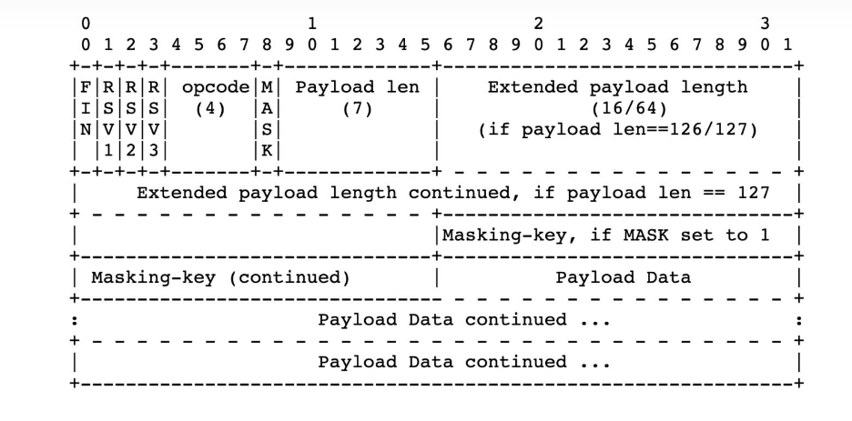

[TOC]

## 1、WebSocket 协议概述

WebSocket 协议主要为了解决基于 HTTP/1.x 的 Web 应用无法实现服务端向客户端主动推送的问题, 为了兼容现有的设施, WebSocket 协议使用与 HTTP 协议相同的端口, 并使用 HTTP Upgrade 机制来进行 WebSocket 握手, 当握手完成之后, 通信双方便可以按照 WebSocket 协议的方式进行交互

WebSocket 使用 TCP 作为传输层协议, 与 HTTP 类似, WebSocket 也支持在 TCP 上层引入 TLS 层, 以建立加密数据传输通道, 即 WebSocket over TLS, WebSocket 的 URI 与 HTTP URI 的结构类似, 对于使用 80 端口的 WebSocket over TCP, 其 URI 的一般形式为 ws://host:port/path/query 对于使用 443 端口的 WebSocket over TLS, 其 URI 的一般形式为 wss://host:port/path/query

在 WebSocket 协议中, 帧 (frame) 是通信双方数据传输的基本单元, 与其它网络协议相同, frame 由 Header 和 Payload 两部分构成, frame 有多种类型, frame 的类型由其头部的 Opcode 字段 (将在下面讨论) 来指示, WebSocket 的 frame 可以分为两类, 一类是用于传输控制信息的 frame (如通知对方关闭 WebSocket 连接), 一类是用于传输应用数据的 frame, 使用 WebSocket 协议通信的双方都需要首先进行握手, 只有当握手成功之后才开始使用 frame 传输数据
## 2、WebSocket 握手
当客户端想要使用 WebSocket 协议与服务端进行通信时, 首先需要确定服务端是否支持 WebSocket 协议, 因此 WebSocket 协议的第一步是进行握手, WebSocket 握手采用 HTTP Upgrade 机制, 客户端可以发送如下所示的结构发起握手 (请注意 WebSocket 握手只允许使用 HTTP GET 方法):
```
GET /chat HTTP/1.1
Host: server.example.com
Upgrade: websocket
Connection: Upgrade
Sec-WebSocket-Key: dGhlIHNhbXBsZSBub25jZQ==
Origin: http://example.com
Sec-WebSocket-Protocol: chat, superchat
Sec-WebSocket-Version: 13
```
在 HTTP Header 中设置 Upgrade 字段, 其字段值为 websocket, 并在 Connection 字段指示 Upgrade, 服务端若支持 WebSocket 协议, 并同意握手, 可以返回如下所示的结构:
```
HTTP/1.1 101 Switching Protocols
Upgrade: websocket
Connection: Upgrade
Sec-WebSocket-Accept: s3pPLMBiTxaQ9kYGzzhZRbK+xOo=
Sec-WebSocket-Protocol: chat
Sec-WebSocket-Version: 13
```
我们来详细讨论 WebSocket 的握手细节, 客户端发起握手时除了设置 Upgrade 之外, 还需要设置其它的 Header 字段

| Sec-WebSocket-Key |, 必传, 由客户端随机生成的 16 字节值, 然后做 base64 编码, 客户端需要保证该值是足够随机, 不可被预测的 (换句话说, 客户端应使用熵足够大的随机数发生器), 在 WebSocket 协议中, 该头部字段必传, 若客户端发起握手时缺失该字段, 则无法完成握手
| Sec-WebSocket-Version |, 必传, 指示 WebSocket 协议的版本, RFC 6455 的协议版本为 13, 在 RFC 6455 的 Draft 阶段已经有针对相应的 WebSocket 实现, 它们当时使用更低的版本号, 若客户端同时支持多个 WebSocket 协议版本, 可以在该字段中以逗号分隔传递支持的版本列表 (按期望使用的程序降序排列), 服务端可从中选取一个支持的协议版本
| Sec-WebSocket-Protocol |, 可选, 客户端发起握手的时候可以在头部设置该字段, 该字段的值是一系列客户端希望在于服务端交互时使用的子协议 (subprotocol), 多个子协议之间用逗号分隔, 按客户端期望的顺序降序排列, 服务端可以根据客户端提供的子协议列表选择一个或多个子协议
| Sec-WebSocket-Extensions |, 可选, 客户端在 WebSocket 握手阶段可以在头部设置该字段指示自己希望使用的 WebSocket 协议拓展
服务端若支持 WebSocket 协议, 并同意与客户端握手, 则应返回 101 的 HTTP 状态码, 表示同意协议升级, 同时应设置 Upgrade 字段并将值设置为 websocket, 并将 Connection 字段的值设置为 Upgrade, 这些都是与标准 HTTP Upgrade 机制完全相同的, 除了这些以外, 服务端还应设置与 WebSocket 相关的头部字段:

| Sec-WebSocket-Accept |, 必传, 客户端发起握手时通过 | Sec-WebSocket-Key | 字段传递了一个将随机生成的 16 字节做 base64 编码后的字符串, 服务端若接收握手, 则应将该值与 WebSocket 魔数 (Magic Number) "258EAFA5-E914-47DA- 95CA-C5AB0DC85B11" 进行字符串连接, 将得到的字符串做 SHA-1 哈希, 将得到的哈希值再做 base64 编码, 最终的值便是该字段的值, 举例来说, 假设客户端传递的 Sec-WebSocket-Key 为 "dGhlIHNhbXBsZSBub25jZQ==", 服务端应首先将该字符串与 WebSocket 魔数进行字符串拼接, 得到 "dGhlIHNhbXBsZSBub25jZQ==258EAFA5-E914-47DA-95CA- C5AB0DC85B11", 然后对该字符串做 SHA-1 哈希运算得到哈希值 0xb3 0x7a 0x4f 0x2c 0xc0 0x62 0x4f 0x16 0x90 0xf6 0x46 0x06 0xcf 0x38 0x59 0x45 0xb2 0xbe 0xc4 0xea, 然后对该哈希值做 base64 编码, 最终得到 Sec-WebSocket-Accept 的值为 s3pPLMBiTxaQ9kYGzzhZRbK+xOo=, 当客户端收到服务端的握手响应后, 会做同样的运算来校验该值是否符合预期, 以便于判断服务端是否真的支持 WebSocket 协议, 设置这个环节的目的就是为了最终校验服务端对 WebSocket 协议的支持性, 因为单纯使用 Upgrade 机制, 对于一些没有正确实现 HTTP Upgrade 机制的 Web Server, 可能也会返回预期的 Upgrade, 但实际上它并不支持 WebSocket, 而引入 WebSocket 魔数并进行这一系列操作后可以很大程度上确定服务端确实支持 WebSocket 协议
| Sec-WebSocket-Protocol |, 可选, 若客户端在握手时传递了希望使用的 WebSocket 子协议, 则服务端可在客户端传递的子协议列表中选择其中支持的一个, 服务端也可以不设置该字段表示不希望或不支持客户端传递的任何一个 WebSocket 子协议
| Sec-WebSocket-Extensions |, 可选, 与 Sec-WebSocket-Protocol 字段类似, 若客户端传递了拓展列表, 可服务端可从中选择其中一个做为该字段的值, 若服务端不支持或不希望使用这些扩展, 则不设置该字段
| Sec-WebSocket-Version |, 必传, 服务端从客户端传递的支持的 WebSocket 协议版本中选择其中一个, 若客户端传递的所有 WebSocket 协议版本对服务端来说都不支持, 则服务端应立即终止握手, 并返回 HTTP 426 状态码, 同时在 Header 中设置 | Sec-WebSocket-Version | 字段向客户端指示自己所支持的 WebSocket 协议版本列表
服务端若接收客户端的握手, 便按上述所表述的规则向客户端返回握手响应, 客户端对服务端返回的握手响应做校验, 若校验成功, 则 WebSocket 握手成功, 之后双方就可以开始进行双向的数据传输。客户端在发起握手后必须处于阻塞状态, 换句话说, 客户端必须等待服务端发回响应之后才允许开始数据传递, 客户端对服务端的握手响应的校验机制如下:

客户端应首先检查服务端返回的状态码是否为 101, 只有在 HTTP 状态码为 101 时才代表服务端同意了协议升级, 对于其它类型的状态码, 客户端应根据 HTTP 状态码的语义做相应的处理
客户端应检查服务端返回的响应是否包含 Upgrade 字段, 若缺失, 代表 Upgrade 未成功, 客户端应终止 WebSocket 握手
客户端应检查 Upgrade 字段的值是否为 websocket (该字段是大小写不敏感的, 如 websocket, WebSocket, webSocket 等都是合法的), 若不是, 客户端应终止 WebSocket 握手
客户端应采用如上所表述的方式校验服务端返回的 Sec-WebSocket-Accept 字段的值是否合法, 若该字段不存在或值不符合预期, 则客户端应终止 WebSocket 握手
若服务端返回的 Header 中包含 Sec-WebSocket-Extensions, 但其字段的值并不在客户端最初向服务端发起握手时传递的 Sec-WebSocket-Extensions 的值列表中, 则客户端应终止 WebSocket 握手
若服务端返回的 Header 中包含 Sec-WebSocket-Protocol, 但该字段的值并不在客户端最初向服务端发起握手时传递的 Sec-WebSocket-Protocol 的值列表中, 则客户端应终止 WebSocket 握手
若客户端校验服务端的握手响应通过, 则 WebSocket 握手阶段完成, 接下来双方就可以进行 WebSocket 的双向数据传输了

## 3、WebSocket 数据帧 (frame)
WebSocket 以 frame 为单位传输数据, frame 是客户端和服务端数据传输的最小单元, 当一条消息过长时, 通信方可以将该消息拆分成多个 frame 发送, 接收方收到以后重新拼接、解码从而还原出完整的消息, 在 WebSocket 中, frame 有多种类型, frame 的类型由 frame 头部的 Opcode 字段指示, WebSocket frame 的结构如下所示:




该结构的字段语义如下:

FIN, 长度为 1 比特, 该标志位用于指示当前的 frame 是消息的最后一个分段, 因为 WebSocket 支持将长消息切分为若干个 frame 发送, 切分以后, 除了最后一个 frame, 前面的 frame 的 FIN 字段都为 0, 最后一个 frame 的 FIN 字段为 1, 当然, 若消息没有分段, 那么一个 frame 便包含了完成的消息, 此时其 FIN 字段值为 1
RSV 1 ~ 3, 这三个字段为保留字段, 只有在 WebSocket 扩展时用, 若不启用扩展, 则该三个字段应置为 1, 若接收方收到 RSV 1 ~ 3 不全为 0 的 frame, 并且双方没有协商使用 WebSocket 协议扩展, 则接收方应立即终止 WebSocket 连接
Opcode, 长度为 4 比特, 该字段将指示 frame 的类型, RFC 6455 定义的 Opcode 共有如下几种:
0x0, 代表当前是一个 continuation frame
0x1, 代表当前是一个 text frame
0x2, 代表当前是一个 binary frame
0x3 ~ 7, 目前保留, 以后将用作更多的非控制类 frame
0x8, 代表当前是一个 connection close, 用于关闭 WebSocket 连接
0x9, 代表当前是一个 ping frame (将在下面讨论)
0xA, 代表当前是一个 pong frame (将在下面讨论)
0xB ~ F, 目前保留, 以后将用作更多的控制类 frame


Mask, 长度为 1 比特, 该字段是一个标志位, 用于指示 frame 的数据 (Payload) 是否使用掩码掩盖, RFC 6455 规定当且仅当由客户端向服务端发送的 frame, 需要使用掩码覆盖, 掩码覆盖主要为了解决代理缓存污染攻击 (更多细节见 RFC 6455 Section 10.3)
Payload Len, 以字节为单位指示 frame Payload 的长度, 该字段的长度可变, 可能为 7 比特, 也可能为 7 + 16 比特, 也可能为 7 + 64 比特. 具体来说, 当 Payload 的实际长度在 [0, 125] 时, 则 Payload Len 字段的长度为 7 比特, 它的值直接代表了 Payload 的实际长度; 当 Payload 的实际长度为 126 时, 则 Payload Len 后跟随的 16 位将被解释为 16-bit 的无符号整数, 该整数的值指示 Payload 的实际长度; 当 Payload 的实际长度为 127 时, 其后的 64 比特将被解释为 64-bit 的无符号整数, 该整数的值指示 Payload 的实际长度
Masking-key, 该字段为可选字段, 当 Mask 标志位为 1 时, 代表这是一个掩码覆盖的 frame, 此时 Masking-key 字段存在, 其长度为 32 位, RFC 6455 规定所有由客户端发往服务端的 frame 都必须使用掩码覆盖, 即对于所有由客户端发往服务端的 frame, 该字段都必须存在, 该字段的值是由客户端使用熵值足够大的随机数发生器生成, 关于掩码覆盖, 将下面讨论, 若 Mask 标识位 0, 则 frame 中将设置该字段 (注意是不设置该字段, 而不仅仅是不给该字段赋值)
Payload, 该字段的长度是任意的, 该字段即为 frame 的数据部分, 若通信双方协商使用了 WebSocket 扩展, 则该扩展数据 (Extension data) 也将存放在此处, 扩展数据 + 应用数据, 它们的长度和便为 Payload Len 字段指示的值


## 4、WebSocket 掩码算法
RFC 6455 规定所有由客户端发往服务端的 WebSocket frame 的 Payload 部分都必须使用掩码覆盖, 这是为了避免代理缓存污染攻击 (更多细节见 RFC 6455 Section 10.3), 若服务端接收到没有使用掩码覆盖的 frame, 服务端应立即终止 WebSocket 连接, 掩码覆盖只针对 frame 的 Payload 部分, 掩码覆盖不会改变 Payload 的长度, 掩码覆盖的算法如下:

客户端使用熵值足够高的随机数生成器随机生成 32 比特的 Masking-Key
以字节为步长遍历 Payload, 对于 Payload 的第 i 个字节, 首先做 i MOD 4 得到 j, 则掩码覆盖后的 Payload 的第 i 个字节的值为原先 Payload 第 i 个字节与 Masking-Key 的第 j 个字节做按位异或操作
我们以 original-octet-i 表示未覆盖前的 Payload 的第 i 个字节, 以 transformed-octet-i 表示覆盖后的 Payload 的第 i 个字节, 以 masking-key-octet-j 表示 Masking-Key 的第 j 个字节, 那么上述算法的操作可以用如下两个式子表示:
```
j                   = i MOD 4
```
transformed-octet-i = original-octet-i XOR masking-key-octet-j
服务端收到客户端的 frame 后, 首先检查 Mask 标志位是否为 1, 若不是则应立即终止握手, 然后根据 Masking-Key 字段的值重复上述操作便可以得到原先的 Payload 数据

## 5、WebSocket 消息分片
当要发送的一条消息过长或者消息是实时产生并不能预测具体的长度时, 客户端可将消息进行分片, 构成一个 frame 后便可以发往服务端, 分片的另一个考虑是为了复用底层的 TCP 连接, 当客户端有多份相互独立的数据需要发送时, 消息分片可以实现在一条 TCP 链路上的复用, 多份数据可以并发地发往服务端, 如果读者了解过 HTTP/2 [RFC 7540] 便可以知道这里也是 HTTP/2 的做法, 但 RFC 6455 并没有具体指出如何实现 WebSocket 分片消息的并发传送, 在 HTTP/2 中, 并发传送是通过 Stream 来关联的, 根据 Stream Identifier, 接收方可以知晓哪些消息是逻辑上连续的消息, 在 WebSocket 中, 若不引进额外机制, 则并发传送时服务端无法区分哪些消息段在逻辑上是同属于一个消息的, 这里需要通过额外的 WebSocket 扩展机制实现, 此处不深入讨论, 下面所讨论的分片场景都是在不并发传送的前提假设下的

消息分片主要利用 frame Header 的 FIN 和 Opcode 字段来实现, 对于未分片的消息, 一个 frame 便承载了完整的消息, 此时它没有后续的 frame, 因此其 FIN 字段为 1, Opcode 根据该消息是文本消息还是二进制消息分别选择 0x1 或 0x2, 而对于分片的消息, 我们以文本消息为例, 文本消息的 Opcode 为 0x1, 若不进行分片, 则 frame 的 FIN 字段为 1, 同时 Opcode 字段为 0x1, 若进行分片, 则第一个分片的 frame 的 FIN 字段为 0, Opcode 为 0x1, 但从第二个直到倒数第二个分片, 其 FIN 字段为 0, 并且 Opcode 字段的值为 0x0 (0x0 代表这是一个 continuation frame), 对于最后一个分片的消息, 其 FIN 字段为 1, 并且 Opcode 字段的值为 0x1, 对于分片消息, 发送端必须按序发送, 因此 TCP 保证交付给上层的数据是有序的, 因此接收端也将按发送端发送的顺序收到消息, 它可以按序拼接分片得到完整的消息

控制类的 frame (如 Ping frame, Pong frame, 将下面讨论) 可以被允许插入在分片消息的发送过程中, 如果不允许, 则对于过长的消息, 其分片数很多, 发送耗时比较长, 控制类的消息需要一直等待消息发送完成而不能及时传递给对方, 将会产生一系列问题 (将在下面讨论)

## 6、WebSocket 控制类 frame
控制类 frame 主要用来传输一些连接控制信息 (如 Close frame 用来关闭 WebSocket 连接), RFC 6455 总共定义了三种控制类 frame, 分别是 Close frame, Ping frame, Pong frame

Close frame
Close frame, 顾名思义, 用来关闭 WebSocket 连接, 当需要关闭 WebSocket 连接时, 通信方向对方发送 Close frame, frame 可以包含 Payload, 如果包含, 则 Payload 的前两个字节以小端字节序表示的 16 位整数指示了相应的错误码, 在其后以 ASCII 编码只是一个错误原因, 这个错误原因不需要具有可读性, 一般用来做调试信息用, 当使用 WebSocket 通信的任何一方收到 Close frame 后, 应继续向对方返回一个 Close frame, 通常需要将错误码回显给对方, 当接收到 Close frame 并向对方发回 Close frame 后, 通信方便可以认为 WebSocket 连接已关闭, 此时应关闭底层的 TCP 连接
Ping frame
Ping frame 是作为一个探测性的 frame, 主要用来实现 WebSocket 层 Keep-Alive, 或者用来探测对方是否仍然是可回复的状态, Ping frame 可以包含 Payload
Pong frame
Pong frame 一方面作为 Ping frame 的响应, 接收方接收到 Ping frame 后应立即发回 Pong frame, 并且 Payload 的内容需要和 Ping frame 相同, 若接收方接收到了多个 Ping frame, 还没来得及回复 Pong frame, 则只需对最后一个 Ping frame 做出回复即可, 另一方面, Pong frame 可以由通信方主动发出, 作为一种心跳包

## 7、WebSocket 挥手
RFC 6455 将连接关闭表述为 Closing Handshake, 我更倾向于将其表述为挥手, 以便与建立连接的握手区分开, WebSocket 的连接关闭分为 CLOSING 和 CLOSED 两个阶段, 当发送完 Close frame 或接收到对方发来的 Close frame 后, WebSocket 连接便从 OPEN 状态转变为 CLOSING 状态, 此时可以称挥手已启动, 通信方接收到 Close frame 后应立即向对方发回 Close frame, 并关闭底层 TCP 连接, 此时 WebSocket 连接处于 CLOSED 状态

## 8、WebSocket 控制类 frame

与 HTTP 不同, WebSocket 在进行数据传输的时候正常情况下都以 frame 为传输单元, 不像 HTTP 协议那样每一次交互都有 Status Code, WebSocket 本身也有状态码, 但只用在 Close frame 中, 用于指示连接关闭的原因 (可能是正常关闭也可能是因为发生了错误)

RFC 6455 定义了多个 WebSocket 状态码:

1000, 代表连接正常关闭
1001, 代表通信方已断开 (Going AWAY), 例如服务端关机或客户端关闭网页
1002, 代表通信方因 protocol error 关闭连接

## 9、总结
WebSocket 协议主要为了解决 HTTP/1.x 缺少双向通信机制的问题, 它使用 TCP 作为传输层协议, 使用 HTTP Upgrade 机制来握手, WebSocket 使用与 HTTP 相同的 80 (WebSocket over TCP) 和 443 (WebSocket over TLS) 端口, 它与 HTTP 是相互独立的协议, 二者没有上下的分层关系, 了解更详细的 WebSocket 细节可以阅读 RFC 6455