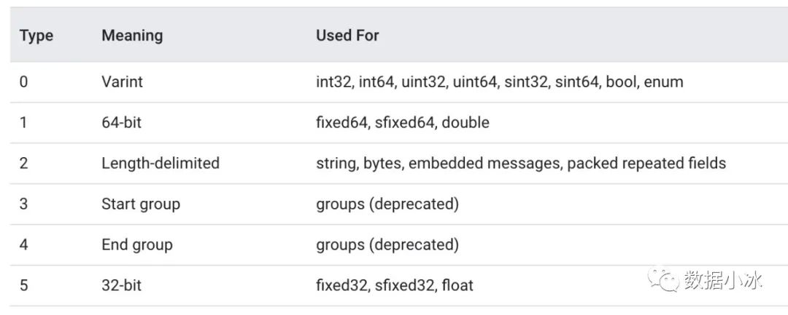
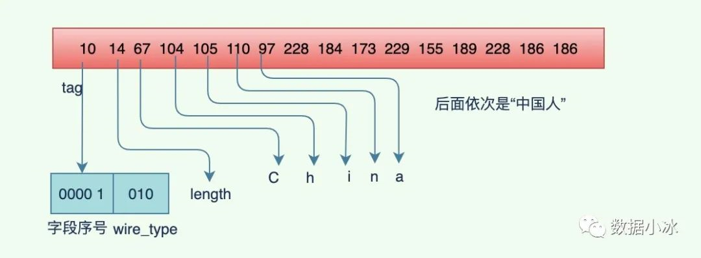
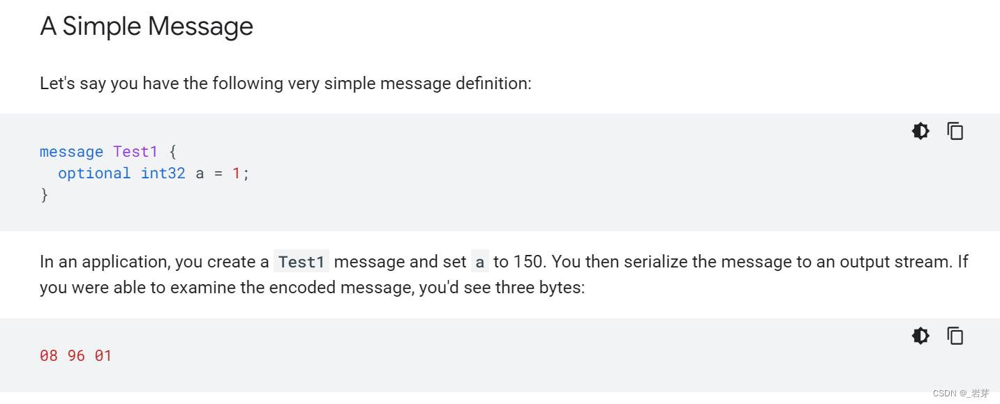

[TOC]

## 1、什么是protobuf
protobuf(Google Protocol Buffers)，官方文档对 protobuf 的定义：protocol buffers 是一种语言无关、平台无关、可扩展的序列化结构数据的方法，可用于数据通信协议和数据存储等，它是 Google 提供的一个具有高效协议数据交换格式工具库，是一种灵活、高效和自动化机制的结构数据序列化方法。相比XML，有编码后体积更小，编解码速度更快的优势；相比于 Json，Protobuf 有更高的转化效率，时间效率和空间效率都是 JSON 的 3-5 倍。

Protocol buffers are Google's language-neutral, platform-neutral, extensible mechanism for serializing structured data – think XML, but smaller, faster, and simpler. You define how you want your data to be structured once, then you can use special generated source code to easily write and read your structured data to and from a variety of data streams and using a variety of languages.

## 2、数据格式
假设我们有一个 person 对象，用 JSON、XML 和 protobuf 表示下它们各是什么样。

用 XML 格式表示如下
```
<person>
    <name>ivy</name>
    <age>24</age>
</person>

```
用 JSON 格式表示如下
```
{
    "name":"ivy",
    "age":24
}
```
用 protobuf 表示如下, 它直接用二进制来表示数据，不像上面 XML 和 JSON 格式那么直观
```
[10 6 69 108 108 105 111 116 16 24]
```
## 3、protobuf优点
### 3.1 性能好/效率高
时间开销：XML 格式化（序列化）的开销还好；但是 XML 解析（反序列化）的开销就不敢恭维了。 但是 protobuf 在这个方面就进行了优化。可以使序列化和反序列化的时间开销都减短。

空间开销：也减少了很多

### 3.2 有代码生成机制
比如写一个类似结构体的内容
```
 message testA  
 {  
    required int32 m_testA = 1;  
 }  
```
像写一个这样的结构，protobuf 可以自动生成它的 .h 文件和点 .cpp 文件。

protobuf 将对结构体 testA 的操作会封装成一个类。

### 3.3 支持向后兼容和向前兼容
当客户端和服务器同时使用一个协议时，客户端在协议中增加一个字节，并不会影响客户端的使用。

### 3.4 支持多种编程语言
在Google官方发布的源代码中包含了
```
C++
C#
Dart
Go
Java
Kotlin
Python
```
## 4、protobuf缺点
### 4.1 二进制格式导致可读性差
为了提高性能，protobuf 采用了二进制格式进行编码。这直接导致了可读性差，影响开发测试时候的效率。当然，在一般情况下，protobuf 非常可靠，并不会出现太大的问题。

### 4.2 缺乏自描述
一般来说，XML 是自描述的，而 protobuf 格式则不是。它是一段二进制格式的协议内容，并且不配合写好的结构体是看不出来什么作用的。

### 4.3 通用性差
protobuf 虽然支持了大量语言的序列化和反序列化，但仍然并不是一个跨平台和语言的传输标准。在多平台消息传递中，对其他项目的兼容性并不是很好，需要做相应的适配改造工作。相比 json 和 XML，通用性还是没那么好。

## 5、使用指南
### 5.1 定义消息类型
proto消息类型文件一般以 .proto 结尾，可以在一个 .proto 文件中定义一个或多个消息类型。

下面是一个搜索查询的消息类型定义，在最开头的 syntax 描述的是版本信息，proto 目前有两个版本 proto2 和 proto3。

syntax="proto3" 明确的设置了语法格式为 proto3，如果不设置 syntax 即默认为 proto2。query 为要查询的内容，page_number 表示查询有多少页，每页的数量为 result_per_page 个。syntax="proto3" 必须位于 .proto 文中除去注释和空行的第一行。

下面的消息包含3个字段 (query,page_number,result_per_page)，每个字段有一个类型，字段名称和字段编号。字段类型可以是 string、int32、enum 或者复合类型。
```
syntax = "proto3";

message SearchRequest {
  string query = 1;
  int32 page_number = 2;
  int32 result_per_page = 3;
}
```
### 5.2 字段编号
消息类型中的每个字段都需要定义唯一的编号，该编号会用来识别二进制数据中字段。编号在 [1,15] 范围内可以用一个字节编码表示。在 [16,2047] 范围可以用两个字节编码表示。所以将 15 以内的编号留给频繁出现的字段可以节省空间。编号的最小值为 1，最大值为 2^29-1=536870911。不能使用 [19000，19999] 范围内的数字，因为该范围内的数字被proto编译器内部使用。同理，其他预先已经被保留的数字也不能使用。

### 5.3 字段规则
每个字段可以被 singular 或者 repeated 修饰。在 proto3 语法中，如果不指定修饰类型，默认值为 singular. singular: 表示被修饰的字段最多出现 1次，即出现 0次或 1次。repeated: 表示被修饰的字段可以出现任意次，包括 0次。在 proto3 语法中，repeated 修饰的字段默认采用 packed 编码。

### 5.4 注释
可以给 .proto 文件添加注释，注释语法与 C/C++ 风格相同，使用 // 或者 /* ... */。
```
/* SearchRequest represents a search query, with pagination options to
 * indicate which results to include in the response. */

message SearchRequest {
  string query = 1;
  int32 page_number = 2;  // Which page number do we want?
  int32 result_per_page = 3;  // Number of results to return per page.
}
```
### 5.5 保留字段
当删掉或者注释掉 message 中的一个字段时，将来其他开发人员在更新 message 定义时可以重用之前的字段编号。如果他们意外载入了旧版本的 .proto 文件将会导致严重的问题，例如数据损坏。一种避免问题产生的方式是指定保留的字段编号和字段名称。如果将来有人用了这些字段编号将在编译 proto 的时候产生错误，显示提醒 proto 有问题。

注意：不要对同一个字段混合使用字段名称和字段编号。
```
message Foo {
  reserved 2, 15, 9 to 11;
  reserved "foo", "bar";
}
```
### 5.6 字段类型与语言类型映射
定义好的 .proto 文件可以通过生成器产生 Go 语言代码，a.proto 文件产生的 go 文件为 a.pb.go 文件。

proto 中基本类型与 Go 语言类型映射如下表。这里只列举了与 Go 和 C/C++ 之间类型的映射，其他语言参考 https://developers.google.com/protocol-buffers/docs/proto3
.proto | Go Type | C++ Type
---|---|---
double |	float64 |	double
float |	float32 |	float
int32 |	int32 |	int32
int64 |	int64 |	int64
uint32 |	uint32 |	uint32
uint64 |	uint64 |	uint64
sint32 |	int32 |	int32
sint64 |	int64 |	int64
fixed32 |	uint32 |	uint32
fixed64 |	uint64 |	uint64
sfixed32 |	int32 |	int32
sfixed64 |	int64 |	int64
bool |	bool |	bool
string |	string |	string
bytes |	[] |byte	string
### 5.7 缺省值
.proto Type | default value
---|---
string	| ""
bytes	| []byte
bool	| false
numeric | types	0
enums	| first defined enum value
### 5.8 枚举类型
在定义消息的时候，希望字段的值只能是预期某些值中的一个。

例如，现在为 SearchRequest 添加 corpus 字段，它的值只能是 UNIVERSAL、WEB、IMAGES、LOCAL、NEWS、PRODUCTS 和 VIDEO 中的一个。可以非常简单的通过向消息定义中添加枚举，并为每个可能的枚举值添加常量来实现。
```
message SearchRequest {
  string query = 1;
  int32 page_number = 2;
  int32 result_per_page = 3;
  enum Corpus {
    UNIVERSAL = 0;
    WEB = 1;
    IMAGES = 2;
    LOCAL = 3;
    NEWS = 4;
    PRODUCTS = 5;
    VIDEO = 6;
  }
  Corpus corpus = 4;
}
```
Corpus 枚举的第一个常量必须映射到 0，所有枚举定义都需要包含一个常量映射到 0，并且该值为枚举定义的第一行内容。因为这样我们可以将 0作为枚举的默认值，proto2 语法中首行的枚举值总是默认值，为了兼容 0值必须作为定义的首行。

### 5.9 导入其他proto
在一个 .proto 文件中可以导入其他 .proto 文件，这样就可以使用它导入的 .proto 中定义的消息类型了。
```
import "myproject/other_protos.proto";
```
默认情况下，只能使用直接导入的 .proto 文件中定义的消息。但是，有时候可能需要将 .proto 文件移动到新位置，有一种巧妙的做法是在旧位置放一个虚拟的 .proto 文件。在文件中使用 import public 语法将所有导入转发到新位置，而不是直接移动 .proto 文件并在一次更改中更新所有调用点。任何导入包含 import public 语句中的 proto 文件的地方都可以传递依赖导入的公共依赖项。下面同一个例子来理解这里的内容。

在当前的文件夹下有 a.proto 和 b.proto 文件，现在在 a.proto 文件中 import 了 b.proto 文件。即在 a.proto 文件中有下面的内容
```
import "b.proto";
```
假设现在 b.proto 中的消息要放入到一个 common/com.proto 文件中，可以方便其他地方也使用，这时可以修改 b.proto 在里面 import com.proto 即可.注意要「import public」, 因为单独的 import 只能使用 b.proto 中定义的消息，并不能使用 b.proto 中 import 的 proto 文件中的消息类型。

```
// b.proto文件, 将里面的消息定义移动了common/com.proto文件，
// 在里面添加下面的import语句

import public "common/com.proto"
```
在使用 protoc 编译时，需要使用选项 -I 或 --proto_path 通知 protoc 去什么地方查找 import 的文件，如果不指定搜索路径，protoc 将会在当前目录下（调用protoc的路径）下查找。

可以导入 proto2 版本中的消息类型到 proto3 文件中使用，也可以在 proto2 文件中导入 proto3 版本的消息类型。但是在 proto2 的枚举类型不能直接应用到proto3的语法中。

### 5.10 嵌套消息
消息类型可以定义在消息类型的内部，即嵌套定义，里面下面的 Result 类型定义在 SearchResponse 的内部。不单单是一层嵌套，也可以多层嵌套。
```
message SearchResponse {
  message Result {
    string url = 1;
    string title = 2;
    repeated string snippets = 3;
  }
  repeated Result results = 1;
}

```
外面的消息类型使用其他消息内部的消息，下面的 SomeOtherMessage 类型使用到了 Result，可以使用 SearchResponse.Result。
```
message SomeOtherMessage {
  SearchResponse.Result result = 1;
}
```
### 5.11 未知字段
未知字段是 proto 编译器无法识别的字段，例如当旧二进制文件解析具有新字段的新二进制文件发送的数据时，这些新字段将成为旧二进制文件中的未知的字段。在初版的 proto3 中消息解析时会丢掉未知的字段，但在 3.5 版本时，重新引入了未知字段的保留，未知字段在解析期间会保留，并包含在序列化输出中。

## 6、编码原理
protobuf高效的秘密在于它的编码格式，它采用了 TLV(tag-length-value) 编码格式。每个字段都有唯一的 tag 值，它是字段的唯一标识。length 表示 value 数据的长度，length 不是必须的，对于固定长度的 value，是没有 length 的。value 是数据本身的内容。


对于 tag 值，它有 field_number 和 wire_type 两部分组成。field_number 就是在前面的 message 中我们给每个字段的编号，wire_type 表示类型，是固定长度还是变长的。 wire_type 当前有0到5一共6个值，所以用3个 bit 就可以表示这6个值。tag 结构如下图。


wire_type 值如下表, 其中3和4已经废弃，我们只需要关心剩下的4种。对于 Varint 编码数据，不需要存储字节长度 length。这种情况下，TLV 编码格式退化成 TV 编码。对于64-bit和32-bit也不需要 length，因为type值已经表明了长度是8字节还是4字节。



### 6.1 Varint编码原理
Varint 顾名思义就可变的 int,是一种变长的编码方式。值越小的数字，使用越少的字节表示，通过减少表示数字的字节数从而进行数据压缩。对于 int32 类型的数字，一般需要4个字节表示，但是采用 Varint 编码，对于小于128的 int32 类型的数字，用1个字节来表示。对于很大的数字可能需要5个字节来表示，但是在大多数情况下，消息中一般不会有很大的数字，所以采用 Varint 编码可以用更少的字节数来表示数字。Varint 是变长编码，那它是怎么区分出各个字段的呢？也就是怎么识别出这个数字是1个字节还是2个字节，Varint 通过每个字节的最高位来识别，如果字节的最高位是1，表示后续的字节也是该数字的一部分，如果是0，表示这是最后一个字节，且剩余7位都用来表示数字。虽然这样每个字节会浪费掉 1bit 空间，也就是 1/8=12.5% 的浪费，但是如果有很多数字不用固定的4字节，还是能节省不少空间。

下面通过一个例子来详细学习编码方法，现在有一个int32类型的数字65，它的Varint编码过程如下，可以看到占用4字节的65编码后只占用1个字节。


int32类型的数字128编码过程如下，4字节的128编码后只占用2个字节。


对于 Varint 解码是上面过程的一个逆过程，也比较简单，这里就不在举例说明了。

### 6.2 Zigzag编码
我们知道，负数的符号位为数字的最高位，它的最高位是1，所以对于负数用 Varint 编码一定为占用5个字节。这是不划算的，明明是4字节可以搞定的，现在统统都需要5个字节。所以 protobuf 定义了 sint32 和 sint64 类型来表示负数，先采用 Zigzag 编码，将有符号的数转成无符号的数，在采用 Varint 编码，从而减少编码后字节数。

Zigzag采用无符号数来表示有符号数，使得绝对值小的数字可以采用比较少的字节来表示。在理解Zigzag编码之前，我们先来看几个概念。

原码：最高位为符号位，剩余位表示绝对值 反码：除符号位外，对原码剩余位依次取反 补码：对于正数，补码为其本身，对于负数，除符号位外对原码剩余位依次取反然后+1

下面以int32类型的数-2为例，分析它的编码过程。如下图所示。


总结起来，对于负数对其补码做运算操作，对于数n,如果是 sint32 类型，则执行(n<<1)(n>>31)操作，如果是sint64则执行(n<<1)(n>>63), 通过前面的操作将一个负数变成了正数。这个过程就是 Zigzag 编码，最后在采用 Varint 编码。

因为 Varint 和 Zigzag 编码可以自解析内容的长度，所以可以省略长度项。TLV 存储简化为了 TV 存储，不需 length 项。


前面讲解了每个字段有 tag 和 value 构成，对于 string 类型，还有 length 字段。下面来看 tag 和 value 值的计算方法。

### 6.3 tag
tag中存储了字段的标识信息和数据类型信息，也就是说 tag=wire_type (字段数据类型)+ field_number (标识号)。通过 tag 可以获取它的字段编号，对应上定义的消息字段。计算公式为tag=field_number<<3 | wire_type, 然后在对其采用 Varint 编码。

### 6.4 value
value是采用Varint和Zigzag编码后的消息字段的值。下面是各个 wire_type 对应的存储类型一个总结。

wire_type | 编码方法 | 编码长度 | 存储方式 | 数据类型
---|---|---|---|---
0	| Varint|	变长|	T-V|	int32 int64 uint32 uint64 bool enum
0	| Zigzag+Varint	|变长|	T-V	|sint32 sint64
1	| 64-bit	|固定8字节|	T-V	|fixed64 sfixed64 double
2	| length-delimi|	变长	|T-L-V|	string bytes packed repeated fields embedded
3	| start group	|已废弃	|	已废弃|
4	| end group	|已废弃		|已废弃|
5	| 32-bit	|固定4字节	|T-V	|fixed32 sfixed32 float
### 6.5 string编码
字段类型为 string 类型，字段值采用 UTF-8 编码，下面是一个字符串编码的示例，字段序列号为1，编码的字符串内容是“China中国人”， proto 编码之后的内容见下面的输出。
```
message stringEncodeTest {
  string test = 1;
}

func stringEncodeTest(){
 vs:=&api.StringEncodeTest{
  Test:"China中国人",
 }
 data,err:=proto.Marshal(vs)
 if err!=nil{
  fmt.Println(err)
  return
 }
 fmt.Printf("%v\n",data)
}

```
编码之后的二进制内容如下，第一个字节内容tag值，第二个字节内容14是 length，表示后面的字符串有14个字节。为啥是14个字节呢？“China中国人”不是8个字节吗？因为字符串采用的是UTF-8编码，每个中文字用3个字节编码，所以"中国人"编码之后占9个字节，在加上前面的China，一共是14个字节。
```
[10 14 67 104 105 110 97 228 184 173 229 155 189 228 186 186]
```




### 6.6 嵌套类型编码
嵌套消息就是value又是一个字段消息，外层消息存储采用 TLV 存储，它的 value 又是一个 TLV 存储。整个编码结构如下图所示。


带有 packed 的 repeated 字段
repeaded 修饰的字段可以带 packed 或者不带。对于同一个 repeated 字段，多个字段值来说，它们的 tag 都是相同的，即数据类型和字段序号都相同。如果采用多个 TV 存储，则存在 tag 的冗余。如果设置 packed=true 的 repeated 字段存储方式，即相同的 tag 只存储一次，添加 repeated 字段下所有值的长度 length,构成 TLVVV... 存储结构，可以压缩序列化后数据长度，节省传输开销。
```
message repeatedEncodeTest{
   // 方式1，不带packed
   repeated int32 cat = 1;
   // 方式2，带packed
   repeated  int32 dog = 2 [packed=true];
}

```

## 7 例子


